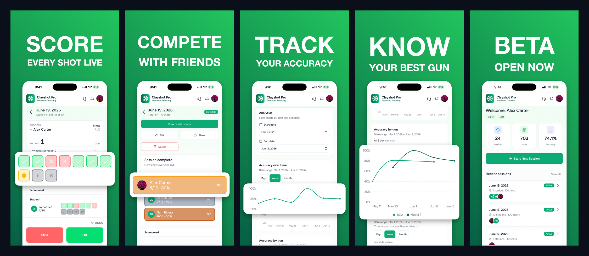

# App Store Screenshot Generator

Local web app to turn your own app screenshots into high-converting App Store / Google Play marketing screenshots — bold heading + subtext over a solid or gradient background, an optional **native cut-out pop-out** (lift a region out, enlarged, white-framed with a shadow), then one-click export to every required iOS + Android size.

No device-frame rendering and no AI — you supply the screenshot, the tool frames and dresses it deterministically. What you see in the preview is exactly what exports.



## Setup

```bash
npm install
npm run dev                 # http://localhost:5173
```

No API key, no backend — it's a pure static client. Rendering, resizing, and zipping all happen in the browser.

## Live

**[sc-gen.liamkienitz.com](https://sc-gen.liamkienitz.com/)**

## Versions / drafts

- Your work **autosaves** continuously to the browser's `localStorage` — reload and it comes back.
- Save **named versions** (Saves tab) to keep multiple variants; Load or delete any of them later.
- Drafts live in `localStorage` (autosave key is `_autosave`, hidden from the list). They're per-browser; clearing site data wipes them.

## How to use

1. **How many?** — slider, 1–10 screenshots.
2. Per screen: **drop your app screenshot**, type a one-word **Heading** (e.g. `SCORE`) and **Subtext** (e.g. `EVERY SHOT LIVE`).
3. Set **font, weight, italic, sizes**, and nudge **heading / screen position / scale**. A safe-zone keeps text clear of crop edges.
4. **Pop-out** (optional): tick *Enable*, then drag the green box over the region you want to lift out (e.g. a score row), drag the corner to resize. Tune its **width** and **vertical** position. It renders enlarged, white-framed, with a drop shadow, floating beyond the card edges.
5. Pick a **Background** for the whole set — solid swatch, custom color, or gradient (angle + 2 stops).
6. **Export** — pick sizes (Export tab), click Export. You get an `appstore-screenshots.zip` in your browser's Downloads. Each screen is resized to exact store dimensions in-browser and foldered by platform.

## Output sizes

| Platform | Size (px) | Notes |
|---|---|---|
| iPhone 6.9" | 1320 × 2868 | ★ App Store Connect primary |
| iPhone 6.7" | 1290 × 2796 | |
| iPhone 6.5" | 1242 × 2688 | |
| iPad 13" | 2064 × 2752 | |
| iPad 12.9" | 2048 × 2732 | |
| Android phone | 1080 × 1920 | ★ Google Play |
| Android 7" tablet | 1206 × 2144 | |
| Android 10" tablet | 1449 × 2576 | |

iOS art is reused for Android via center cover-crop. Apple's iPhone ratio (~0.46) is narrower than Android 9:16, so the compositor keeps all text/content inside a center safe zone — nothing important is clipped on any target. Legacy iPhone sizes (5.5"/4.7"/4"/3.5") are intentionally excluded — App Store Connect no longer accepts them for new apps.

## How it works

`compose → export`

- **compose** (`src/lib/render.js`) — deterministic HTML-canvas render at the 1320×2868 master: background, screenshot card (high, bottom bleeds off), auto-fit heading, wrapped subtext, and the native pop-out (`drawPopout`: crop a region → enlarge → white frame + shadow → float over the card). Same code drives the live preview and the export, so what you see is what ships.
- **export** (`src/lib/api.js → exportZip`) — each rendered master is scaled to exact target pixels in a `<canvas>` and zipped with JSZip, foldered by platform — all client-side, no server.

## Project layout

```
shared/sizes.js        size matrix + safe-zone constants
src/lib/render.js      canvas compositor incl. drawPopout (single source of truth)
src/lib/api.js         drafts (localStorage) + export (canvas resize + JSZip)
src/lib/fonts.js       font catalog + webfont loader
src/components/        BackgroundPicker, CanvasPreview, PopoutSelector
src/App.jsx            studio UI / state
scripts/               CLI test harness — HTML fixtures + standalone scaffold builder
output/                generated samples + showcase
```

## CLI test harness (optional)

Reproduces the pipeline without the browser, used to validate output:

```bash
# screenshot a reconstructed app screen -> fixture PNG (headless Chrome)
# build scaffold, then enhance via your Gemini MCP / API
node scripts/scaffold.mjs scripts/fixtures/score.png "SCORE" "EVERY SHOT LIVE" "#16A34A" output/scaffold-01.png
```
